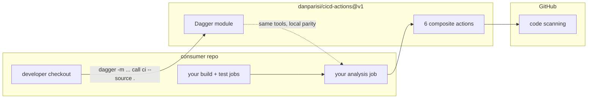
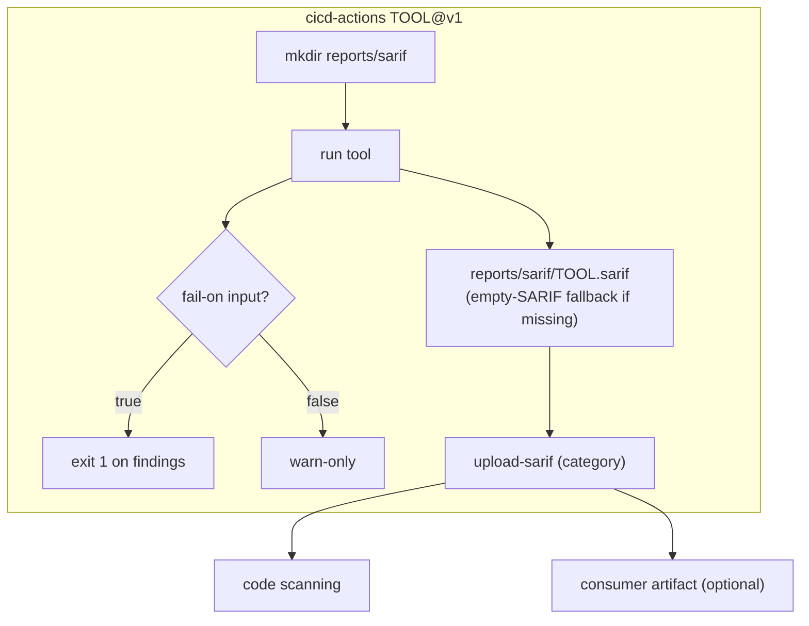
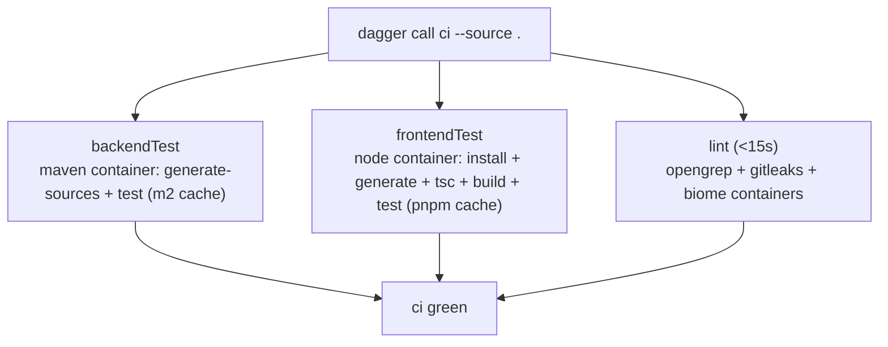

# cicd-actions

Public, app-agnostic library of pluggable CI actions + a Dagger module for local
parity (Apache-2.0). Any repository consumes pinned tools with one line per tool —
no copy-paste, no per-repo tool maintenance. Consumers pin the moving **`@v1`** tag.

## What's inside

```
cicd-actions/
├── opengrep/action.yml      # SAST (p/security-audit,java,typescript) → SARIF
├── trivy-fs/action.yml      # SCA vuln scan (HIGH,CRITICAL) → SARIF, blocking
├── gitleaks/action.yml      # secrets → SARIF, blocking
├── biome/action.yml         # JS/TS lint/format → SARIF, warn-only
├── zizmor/action.yml        # GitHub Actions workflow audit → SARIF, warn-only
├── osv-scanner/action.yml   # dependency advisory scan (recursive) → SARIF, warn-only
├── dagger/                  # Dagger TS-SDK module (backendTest/frontendTest/lint/ci)
├── README.md                # this file: contract, pins, reuse guide
└── LICENSE                  # Apache-2.0
```

## Requirements (consumer side)

- Runner: any GitHub-hosted (`ubuntu-latest`) or self-hosted Linux runner with
  network access (actions download pip packages, npm packages, release binaries
  and container images on first use; warm caches persist on self-hosted hosts).
- Consumer workflow permissions: `contents: read` everywhere; `security-events: write`
  on the job that uploads SARIF (required by `upload-sarif` for code scanning).
- Local runs: Dagger 0.21+ CLI + a running Docker daemon.

## Dependencies — where each binary comes from

Nothing is vendored: every tool binary is fetched at run time (pinned versions),
except when the host already provides it. First use needs network; repeat runs
hit warm caches on persistent hosts.

| Dependency | Used by | When | How obtained | Source |
|---|---|---|---|---|
| `opengrep` binary | `opengrep` action | every analysis run, unless already on `PATH` | `curl` of `opengrep_manylinux_x86` for `v<version>`; a pre-installed host binary wins and skips the download | `opengrep/opengrep` GitHub Releases |
| Trivy (via upstream action) | `trivy-fs` action | every run | `aquasecurity/trivy-action@0.24.0` provisions it; wrapper only passes scan args | GitHub Releases (via upstream action) |
| Gitleaks (via upstream action) | `gitleaks` action | every run | `gitleaks/gitleaks-action@<SHA>` (`# v2`) ships the binary | Upstream action repo |
| `@biomejs/biome` (npm package) | `biome` action | every run | `npx --yes @biomejs/biome@<version>` — fetched and run, no install step | npm registry |
| `zizmor` (pip package) | `zizmor` action | every run | `pip install zizmor==<version>` (`pip3` fallback) | PyPI |
| `osv-scanner` binary | `osv-scanner` action | every run, unless already on `PATH` | `curl` of the bare `osv-scanner_linux_amd64` binary for `v<version>` (no tarball); a pre-installed host binary wins and skips the download | `google/osv-scanner` GitHub Releases |
| `upload-sarif` (JS action) | all six actions | every run | runner resolves the SHA-pinned `github/codeql-action` ref (`# v3`) | `github/codeql-action` repo |
| `opengrep_musllinux_x86` binary | Dagger `lint()` | local `dagger call lint/ci` | `wget` of the musl release binary inside the `node` container (no official opengrep image exists) | `opengrep/opengrep` GitHub Releases |
| `zricethezav/gitleaks:<ver>` image | Dagger `lint()` | local `dagger call lint/ci` | `docker pull` by the Dagger engine | Docker Hub |
| `maven:3.9-eclipse-temurin-25` image | Dagger `backendTest()` | local `dagger call ci` | `docker pull` by the Dagger engine | Docker Hub |
| `node:24-alpine` image | Dagger `frontendTest()` + Biome container | local `dagger call ci`/`lint` | `docker pull` by the Dagger engine | Docker Hub |
| Runner prerequisites (`bash`, `git`, `curl`, `tar`, `python3`/`pip`, `node`/`npx`) | all composite actions | every run — must pre-exist | pre-installed on the runner image/host, never fetched by the actions | Runner environment |

`version` inputs (see catalog) override the defaults per run without touching this repo.

## Reuse from any project

```yaml
# any repo's workflow — one line per tool, no versions to manage
- uses: danparisi/cicd-actions/trivy-fs@v1
- uses: danparisi/cicd-actions/gitleaks@v1
```

```bash
# local parity in any checkout (needs Dagger CLI + Docker)
dagger -m github.com/danparisi/cicd-actions/dagger@v1 call lint --source .  # <15s
dagger -m github.com/danparisi/cicd-actions/dagger@v1 call ci --source .    # full gate
```



## Composite actions (use as `danparisi/cicd-actions/<name>@v1`)

| Action | What it does | Default SARIF |
|---|---|---|
| `opengrep` | Opengrep SAST (`p/security-audit`, `p/java`, `p/typescript`) | `reports/sarif/opengrep.sarif` |
| `trivy-fs` | Trivy filesystem scan (`HIGH,CRITICAL`) | `reports/sarif/trivy-fs.sarif` |
| `gitleaks` | Secret detection via `gitleaks-action` | `reports/sarif/gitleaks.sarif` |
| `biome` | `biome ci` on `frontend/` | `reports/sarif/biome.sarif` |
| `zizmor` | GitHub Actions workflow audit | `reports/sarif/zizmor.sarif` |
| `osv-scanner` | Dependency vulnerability scan (recursive) | `reports/sarif/osv-scanner.sarif` |

Every action accepts `version` (tool version), `fail-on` (`'true'`/`'false'`) and
`output` (SARIF path) inputs, and uploads to code scanning via
`github/codeql-action/upload-sarif` (SHA-pinned, see below).

### Anatomy of one action (same pattern x6)



## Warn-only vs blocking (`fail-on`)

Every action accepts a `fail-on` input (`'true'` / `'false'`):

| Default | Actions | Meaning |
|---|---|---|
| Blocking (`fail-on: 'true'`) | `trivy-fs`, `gitleaks` | Fast-gate: findings fail the workflow (HIGH/CRITICAL vulns, leaked secrets). Set `fail-on: 'false'` to make them informational. |
| Warn-only (`fail-on: 'false'`) | `opengrep`, `biome`, `zizmor`, `osv-scanner` | Findings never fail the workflow; SARIF is still uploaded to code scanning. Set `fail-on: 'true'` to block on findings. |

Blocking behavior is never changed silently: each action's `description`
states its default, and this table is the contract. SARIF upload always
runs (`if: always()`), even when the scan step fails.

Recommended consumer pattern: gate deploys on the analysis job result, with an
explicit override input for red analysis only (never override a red build).

## Reporting recipe (consumer side)

The actions only upload SARIF to code scanning. For a per-run findings table
and downloadable reports, the consumer adds two standard steps:

```yaml
# at the end of the analysis job:
- uses: actions/upload-artifact@v4
  if: always()
  with: { name: sarif-fast, path: reports/sarif/*.sarif, if-no-files-found: warn, retention-days: 14 }
# in a summary job (needs: [analysis], if: always()):
- uses: actions/download-artifact@v4
  with: { name: sarif-fast, path: reports/sarif }
- run: |
    echo "## Analysis Summary" >> $GITHUB_STEP_SUMMARY
    for f in reports/sarif/*.sarif; do
      echo "| $(basename "$f" .sarif) | $(grep -c '"ruleId"' "$f") |" >> $GITHUB_STEP_SUMMARY
    done
```

## Dagger module (`dagger/`)

Local parity with CI: `backendTest`, `frontendTest`, `lint`, `ci`.

Requires Dagger 0.21+ and a running Docker daemon. One-time setup in this
checkout generates the TS-SDK bindings (`dagger/sdk/`, gitignored) — without
it, `dagger call` fails at module load:

```bash
cd dagger && dagger develop
```

```bash
# from an app repo, using the published module:
dagger -m github.com/danparisi/cicd-actions/dagger@v1 call ci --source .

# from a checkout of this repo:
cd dagger
dagger call lint --source /path/to/app
dagger call ci --source /path/to/app   # prints "ci green"
```

Containers: `maven:3.9-eclipse-temurin-25`, `node:24-alpine`,
`zricethezav/gitleaks:v8.30.1` (Opengrep runs as a musl release binary
inside the `node` container — no official image exists).



Note: `lint()` findings fail the call (blocking), but the SARIF it writes
is container-scoped (`/tmp/opengrep.sarif` inside the Opengrep container)
and is NOT uploaded anywhere on local runs — that is intended. SARIF
upload to code scanning happens only in the GitHub composite actions.

## How to add a tool

1. Create `<tool>/action.yml` (composite: `mkdir` + run + `upload-sarif` with a
   new `category`, following the anatomy above; expose `version`/`fail-on`/`output`).
2. Add a row to the catalog table and the pin table in this README.
3. Commit, then move the `v1` tag so consumers pick it up (delete + recreate —
   no `--force`, to satisfy destructive-push guardrails):
   ```bash
   git tag -f v1
   git push origin :refs/tags/v1 && git push origin v1
   ```
4. Open a PR in each consumer to wire `- uses: danparisi/cicd-actions/<tool>@v1`.

## Pinned versions

No `latest` or floating major tags for tools. Third-party actions are
pinned to full commit SHAs (with the version noted in a trailing
comment — keep updated via Dependabot):

| Tool | Pin | As of |
|---|---|---|
| `github/codeql-action/upload-sarif` | `3ea06614dafe36dec890db3446326e0d40ce53d4` (`# v3`) | 2026-09-18 |
| `gitleaks/gitleaks-action` | `ff98106e4c7b2bc287b24eaf42907196329070c7` (`# v2`) | 2025-04-17 |
| `aquasecurity/trivy-action` | `@0.24.0` (already pinned, kept as is) | — |
| `opengrep` (binary, `opengrep` action) | `version` input, default `1.27.1` | 2026-09-18 |
| `zizmor` (pip, `zizmor` action) | `version` input, default `1.30.1` | 2026-09-18 |
| `@biomejs/biome` (npx, `biome` action) | `version` input, default `2.5.12` | 2026-09-18 |
| `osv-scanner` (binary, `osv-scanner` action) | `version` input, default `2.2.4` | pre-existing |
| Dagger `opengrep` binary | `opengrep_musllinux_x86` at `OPENGREP_VERSION` (no official image) | 2026-09-18 |
| Dagger `gitleaks` image | `zricethezav/gitleaks:v8.30.1` | 2026-09-18 |
| Dagger `biome` package | `@biomejs/biome@2.5.12` | 2026-09-18 |

Container image digests are intentionally pinned by immutable version tag
rather than digest (digests are arch-specific). To resolve a digest, run
`docker buildx imagetools inspect <ref>` and record it when promoting a
new version.

## App-agnostic limits

- `frontend/` is a hard requirement: `frontendTest` and the Biome step of
  `lint()` mount `source.directory("frontend")` and fail if the consuming
  repo has no `frontend/` directory (pnpm + Vitest assumed).
- `backendTest` requires a Maven project (`pom.xml`) at the source root.
- No engine is needed to validate the module's TypeScript: `npx tsc --noEmit`
  in `dagger/` typechecks without the Dagger engine or Docker.

## License

Apache-2.0 — see [LICENSE](LICENSE).
